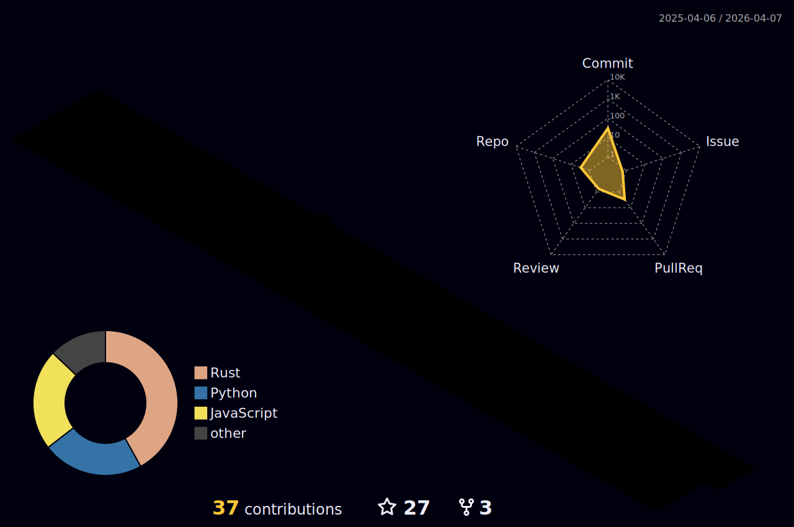

## 👀 Who am I?
💐 I'm **Kito**, from **Can Tho City - Vietnam**! 🇻🇳<br>
📚 I luv **Math** & **Physics**
## 🤔 What can I do?
```ts
export const ICanDo = (): string => {
  const languages = 'JavaScript, TypeScript, Rust, Python, Pascal';
  const frameworks = 'NodeJS, ReactJS, NextJS, TailwindCSS, Framer Motion';
  const databases = 'MongoDB, MySQL, PostgresSQL';
  const tools = 'Visual Studio Code, IntelliJ IDEA';
  const design = 'Photoshop, Aseprite, Figma';
  const systems = 'Windows, Linux (Ubuntu, Arch)';

  return [languages, frameworks, databases, tools, design, systems].join('\n');
}
```
## 👋 The end?
> Nơi tôi có EM là trong GIẤC MƠ <br>
> Thứ GIẾT CHẾT chúng ta là KỶ NIỆM <br>
> You are my ☀️, my 🌙 and all my ⭐'s


